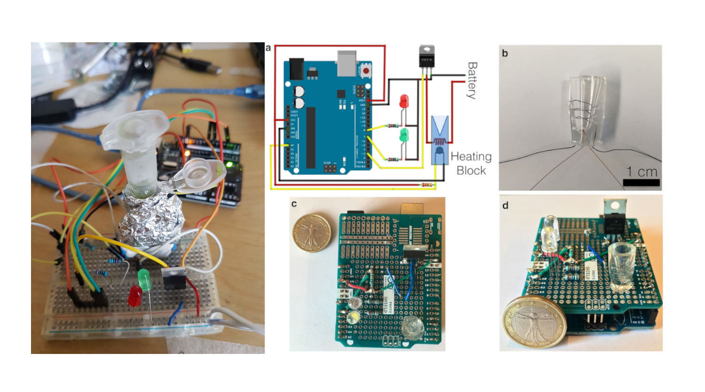

# BREADBOARD-LAMP

BareBones Breadboarded Version of a LAMP DNA Amplification System from the paper by [Velders et al. 2018](https://pubmed.ncbi.nlm.nih.gov/29391052/) Field Point of Care Diagnostics [Shrimping.It](http://start.shrimping.it/) style.

Low cost DIY temperature control by Nickel Cadmium wire from the LAMPShield project facilitates LAMP DNA/RNA amplification to heat and extrude wax and custom biomaterials. Can be combined with the WaxPlotter project for CNC control. 

Low cost DIY temperature control by Nickel Cadmium wire from the LAMPShield project facilitates LAMP DNA/RNA amplification to heat and extrude wax and custom biomaterials. Can be combined with the WaxPlotter project for CNC control. 

Breadboarding field diagnostics and biomaterials tells an exciting story of innovative material configurations that radically democratize knowledge making and technoscience, a core maker desire, a well meaning attempt to change the world. There is another counter story however of slow emergent, care-full diligence, maintenance, strategic patience and productive failure. The key feature of both maker prototyping and scientific practice is failure: it is intimacy, failing, falsifying and testing that produces social learning. Makers and life scientists are often concerned with ongoing care, maintenance and the anticipation of the creativity of failure.

